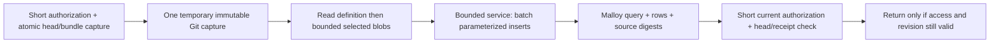
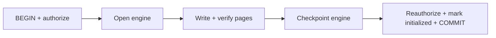
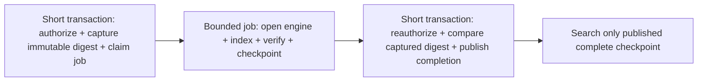

# Synthetic performance kernels

This runner evaluates small, bounded mechanisms using synthetic data. It does
not load the application, credentials, environment files, services, real media,
or PostgreSQL. Each variant runs in a fresh child, serially, with a 45 second
deadline, a 192 MiB V8 old-space limit, and an observed 768 MiB RSS guard checked
between operations. These are precautions, not an OS memory sandbox: PGlite WASM
memory is outside the V8 old-space limit. On macOS there is no hard RSS ceiling.

Run from the repository with Node 24:

```sh
node --import tsx benchmarks/performance/run.ts > /tmp/zoen-kernels.json
node --import tsx benchmarks/performance/run.ts --only git > /tmp/zoen-git.json
node --import tsx benchmarks/performance/run.ts --only sql > /tmp/zoen-sql.json
node --import tsx benchmarks/performance/run.ts --only media > /tmp/zoen-media.json
```

Check that other workers are idle before the SQL run. All fixtures are temporary
and are removed after ordinary completion. Do not launch variants concurrently.
`baseline.json` is a dated local run, not a CI performance threshold.
An RSS guard breach records a blocked variant and stops subsequent variants.

## What is comparable

| Kernel                     | Current mechanism                                                                       | Candidate                                                                                                           | Required equivalence and limitations                                                                                                                                                                                                                                                                     |
| -------------------------- | --------------------------------------------------------------------------------------- | ------------------------------------------------------------------------------------------------------------------- | -------------------------------------------------------------------------------------------------------------------------------------------------------------------------------------------------------------------------------------------------------------------------------------------------------- |
| Git                        | Three complete temporary bundle reconstructions, selected reads of 1, 3, then 3 files   | One immutable capture; either three `git show` calls or two bounded `cat-file --batch` calls after discovery        | Selected document content must match byte for byte. Native Git is used by every variant. The candidate omits the separate database authorization/head recheck, which must remain in the application. Bundle writes and spawn counts are measured; DB/network transfer is not.                            |
| SQL                        | 500 individual parameterized INSERTs, each autocommitted                                | 100 rows per parameterized INSERT; compare both autocommit and an explicit transaction                              | Exactly equal ordered rows, including large decimal strings, Unicode, quotes, booleans, dates and nulls. Batch size 100 gives 600 parameters here; production maximum 30 columns would give 3,000. This measures loading one in-memory PGlite table, excluding Malloy compilation and result evaluation. |
| Media                      | `Buffer.from(Uint8Array).toString("base64")`                                            | `Buffer.from(array.buffer, array.byteOffset, array.byteLength).toString("base64")`                                  | Exactly equal base64 output. The view shares memory: use only when bytes cannot be concurrently mutated; this benchmark uses an owned ordinary ArrayBuffer.                                                                                                                                              |
| Media contract alternative | Base64 output                                                                           | Pass through an existing Uint8Array                                                                                 | A different output API, not a drop-in optimization. No download, upload, browser, streaming, auth or transport time is measured.                                                                                                                                                                         |
| Corpus indexing            | PostgreSQL transaction encompasses engine startup, every page write/read and checkpoint | Immutable authorized capture, durable index job outside a DB transaction, short reauthorization/publish transaction | Design only. Actual PostgreSQL transaction occupancy and cancellation/revocation races are unmeasured pending an allocated isolated DB.                                                                                                                                                                  |

Git's fixture has 16 deterministic text files of approximately 65 KiB each, with
three selected files. SQL uses 500 rows and six columns, below current source
bounds. Media uses one 3 MiB byte array. Correctness checks happen outside timed
regions and are included in process memory peaks. Every trial checks its output.

Each variant includes one first trial, followed by six repeated Git trials, four
warm SQL trials, or twelve warm media trials. SQL initialization is separately
reported; the same PGlite instance is reused for its five loads and truncated
between them. The first trial is not a cold OS cache measurement. No system cache
is flushed. The low-sample nearest-rank p95 is descriptive, not a production p95.

`processPeakRssBytes` includes initialization, fixture construction and validation
in that Node child; it excludes native Git child RSS. CPU is Node process CPU and
also excludes Git subprocess CPU. `applicationTransactionMs` and `databaseBytes`
are explicitly null where not measured. `pgliteExplicitTransactionMs` is actual
elapsed BEGIN-through-COMMIT time, separate from the unmeasured application DB.

## Local observations, 2026-09-30

Node 24.21.0, Apple Git 2.54.0, macOS arm64. The machine had unrelated desktop
background activity. These are descriptive kernel trials, not end-to-end gains.
Raw samples and provenance are preserved in `baseline.json`.

After this baseline was captured, `readMatrixMedia` was corrected to call
`bytes.toString("base64")` directly: its downloader already returns a Buffer.
The implementation needs neither a copy nor another Buffer view. Focused unit
regressions cover a nonzero offset, immutable string output after the backing
bytes change, and workspace/room revocation after download. The recorded kernel
measurements remain historical; they do not measure this application function.

| Variant                          | p50 / p95 ms         | Node process peak MiB | Structural work per trial                                           |
| -------------------------------- | -------------------- | --------------------- | ------------------------------------------------------------------- |
| Git repeated                     | 171.563 / 173.637    | 134.4                 | 3 reconstructions, 16 Git processes, 1,865,946 bundle bytes written |
| Git single capture               | 67.217 / 68.667      | 133.7                 | 1 reconstruction, 6 Git processes, 621,982 bundle bytes written     |
| Git single capture + batch reads | 67.591 / 71.684      | 133.4                 | 1 reconstruction, 5 Git processes, 621,982 bundle bytes written     |
| Media copy + base64              | 0.184 / 0.410        | 158.5                 | 3,145,728 extra bytes copied; 4,194,304 base64 bytes                |
| Media byte view + base64         | 0.139 / 0.377        | 150.7                 | No extra Buffer copy; identical 4,194,304 base64 bytes              |
| SQL row autocommit               | Blocked by RSS guard | Exceeded 768          | No completed comparison; further SQL variants were not run          |

All Git variants returned exactly equal documents. A single capture accounts for
the measured benefit. The batched reader's extra framing code did not improve
this three-file fixture; keep the simpler existing reader until a larger bounded
selection justifies batching. Media also verified a nonzero byte offset of 16,
so a byte view cannot accidentally encode the backing allocation's prefix/suffix.
The RSS peaks include initialization and verification and do not establish an
application memory saving. Binary pass-through has a different client contract
and is deliberately omitted from the performance comparison table.

The SQL attempt used `new PGlite()` with a fresh database. The current production
worker now loads a prebuilt `empty-database.tgz`; this harness does not reproduce
that bootstrap. The guard breach therefore does not establish a service failure.
Do not raise the macOS guard to finish a comparison. Repeat the SQL measurement
using a controlled Linux executor and synthetic empty template matching the
worker, with the actual cgroup memory/deadline limits. PostgreSQL corpus occupancy
also remains unmeasured pending an allocated isolated database.

## Before and after

Current semantic flow (source inspected on 2026-09-30):

```mermaid
flowchart LR
  A[Authorize + SELECT bundle] --> B[Unbundle + read definition]
  B --> C[Authorize + SELECT same bundle]
  C --> D[Unbundle + read definition/model/CSV]
  D --> E[Bounded semantic service]
  E --> F[New PGlite + row INSERTs + Malloy query]
  F --> G[Authorize + SELECT same bundle]
  G --> H[Unbundle + reread captured paths]
  H --> I[Return bounded rows + manifest]
```



Proposed semantic flow (requires production ownership and race tests):



Do not replace the final check with a cached authorization result. Capture
revision and bundle atomically. Reauthorize after work; preserve source hashes,
result limits, deterministic receipts and manifest persistence in Eve history.
Avoid a global cache as the first fix: per-operation immutable capture removes
amplification without a new eviction or revocation owner.

Current corpus flow holds a database connection and authorization locks around
the entire engine operation:



Proposed corpus flow needs durable state rather than merely moving code out of
the transaction:



The job must have an idempotent release/digest key, bounded concurrency, lease
and cancellation behavior, and a complete checkpoint that searches cannot
observe partially. Preserve engine namespace exclusivity and recovery after a
crash between checkpoint and publication. A Rust rewrite does not establish
these invariants.

## Priority and production validation

1. Capture Git once per semantic operation and finish with a lightweight current
   access/revision check. Test publication and revocation races, path bounds,
   missing blobs, invalid UTF-8/bytes if the contract allows them, batch framing,
   timeout/cancellation and temporary directory cleanup. Measure DB bundle bytes
   and connection/lock occupancy in an isolated DB before calling it an app gain.
2. Validate input loading with the worker's empty-template bootstrap, then batch
   parameterized PGlite INSERTs if the bounded comparison confirms the benefit.
   Prove exact numeric handling, empty tables, maximum columns/rows, failed batch
   behavior, cancellation and the Linux service's actual memory/deadline limits.
3. Avoid the redundant media buffer copy while preserving the base64 API. Binary
   streaming is a separate client/API change; it must preserve event-based media
   resolution and final authorization. Measure concurrent downloads, process RSS,
   and client decode/retention before changing the contract.
4. Move corpus engine work into a durable job with short DB transactions only
   after measuring occupancy and designing atomic publication/recovery.

Before a Rust kernel, capture CPU profiles and p50/p95 for representative completed
outcomes, with process-tree/cgroup RSS, bytes read/written/transferred, queue delay,
retry rate and billed compute/egress. Compare improved TypeScript/native libraries
first. Cost per successful outcome includes failed attempts. Break-even months:
engineering cost / (monthly measured savings - additional operations/maintenance).
No speedup or monetary saving is assumed from the implementation language.

Code evidence: `server/workspaces/semantic/published.ts` (three selections),
`server/workspaces/repository.ts` (atomic bundle capture and selection transaction),
`server/workspaces/git.ts` (temporary reconstruction and per-file subprocesses),
`server/workspaces/semantic/worker.ts` (per-row INSERTs),
`server/matrix/media/read.ts` (copy then base64), and
`server/creators/corpus/index.ts` (engine lifetime inside transaction).
