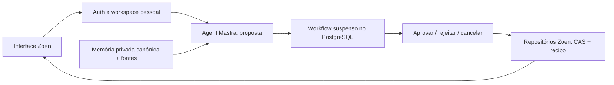

# Piloto Mastra no Zoen

O piloto em `/pilot/mastra` valida conversa, preferência citada, proposta de nota, revisão e gravação durável. É uma implantação experimental separada, desligada por padrão. Ativar o piloto seleciona Mastra para essa implantação; o Next não inicia nem encaminha solicitações para Eve nesse modo. Os outros fluxos do Zoen ainda dependem de Eve.

## O fluxo entregue

1. O usuário entra com a autenticação existente do Zoen.
2. Um Agent do Mastra recebe o histórico da conversa limitado a oito mil tokens e as preferências ativas do repositório privado canônico.
3. Pedir para lembrar uma preferência produz uma proposta com trecho literal da mensagem e digest da fonte imutável. Pedir uma nota produz seu título e conteúdo completos.
4. O workflow nativo persiste a proposta e suspende antes da gravação.
5. Aprovar retoma o mesmo workflow e publica a alteração através dos repositórios existentes. Rejeitar ou cancelar impede a publicação.
6. O recibo inclui a operação e a revisão Git. A nota pode ser baixada na revisão aprovada. Repetir uma aprovação devolve o recibo original.



## Responsabilidades

- `server/mastra/runtime.ts`: Agent, ferramentas que apenas propõem, workflow `plan → review → commit` e armazenamento nativo.
- `server/mastra/pilot.ts`: vínculo da conversa ao proprietário, comandos autenticados, exclusão de execuções simultâneas, leitura do estado público e download.
- `server/mastra/codex.ts`: transporte independente. O `codex app-server` resolve o login e a renovação; o arquivo `auth.json` não é copiado para o projeto. Tokens não entram nos checkpoints nem no log da aplicação.
- `mastra_pilot_conversation` e `mastra_pilot_run`: vínculo com `agent_sessions`, entrada aceita e decisão do produto. Os checkpoints e mensagens ficam nas tabelas nativas do schema `mastra_pilot`.
- `PrivateMemoryRepository` e `WorkspaceRepository`: únicos responsáveis pelas preferências publicadas, suas fontes e arquivos. Working memory e recuperação semântica do Mastra ficam desativadas.

Cada leitura e decisão verifica a sessão atual. Retomar usa o contexto do novo pedido autenticado. O commit revalida o proprietário e exige a decisão de aprovação registrada. Locks de PostgreSQL serializam o envio por conversa e a decisão por execução entre processos, sem manter uma transação aberta durante o modelo. Cancelamento anterior à decisão cerca a gravação; depois que uma decisão foi aceita, ela é imutável.

O `resourceId` nativo é o workspace pessoal autenticado. O setup vincula threads, mensagens e checkpoints aos seus registros do produto por foreign keys com `ON DELETE CASCADE`. Recursos e registros de observação também ficam vinculados ao workspace, mesmo com essas formas de memória desativadas no piloto. Remover uma conversa remove seu histórico e checkpoints; excluir o workspace pessoal na exclusão da conta remove também recursos e observações. Uma persistência atrasada falha no banco quando o proprietário já foi removido. O tombstone imutável existente reaplica a exclusão após um rollback/restauro, antes da inicialização da aplicação. As fontes e publicações canônicas mantêm o ciclo de apagamento existente.

A leitura reconcilia checkpoints suspensos ou concluídos com o registro do produto quando um processo termina entre essas duas persistências. A retomada de proposta pendente após reinício foi exercitada com o modelo real. Isso não comprova retomada automática de uma chamada ao modelo interrompida ou recuperação de toda combinação de falhas durante publicação.

## Rodar em uma implantação isolada

Requisitos: Node 24, pnpm 11.24, PostgreSQL com os papéis `zoen_migrator`/`zoen_app`, payload store configurado e login local do Codex. Use banco, buckets e diretório de fontes próprios para o piloto.

Configure o ambiente normal do Zoen e:

```dotenv
ZOEN_MASTRA_PILOT_ENABLED=true
ZOEN_MASTRA_PILOT_MODEL=gpt-5.6-luna
ZOEN_SESSION_ARCHIVE_DIR=/caminho/privado/zoen-pilot-sources
```

O diretório de fontes é necessário para aprovar preferências citadas. Desativar a memória automática nas configurações existentes impede novas propostas de preferência.

```sh
pnpm install --frozen-lockfile
pnpm db:migrate
pnpm pilot:mastra:setup
pnpm dev --hostname 127.0.0.1 --port 3020
```

`DATABASE_URL_UNPOOLED` deve usar o papel de migração para o setup; `DATABASE_URL` usa o papel da aplicação. O setup inicializa o schema nativo através da API pública do Mastra e concede apenas uso e DML ao papel da aplicação. O runtime usa `disableInit: true` e não requer DDL.

As constraints de propriedade pertencem ao setup, aplicado depois da migração do produto. São verificadas junto das versões fixadas do Mastra. Ambientes descartáveis criados pela versão anterior do piloto precisam ser recriados antes deste setup; não há backfill de IDs nem preservação do histórico experimental. Execute o setup duas vezes para verificar sua idempotência.

Abra `http://127.0.0.1:3020/pilot/mastra` e entre no Zoen. Para testar o build:

```sh
pnpm check
pnpm build
pnpm start --port 3020
```

Mantenha a mesma flag no build e na inicialização. Removê-la ou defini-la como `false` mantém a implantação padrão com Eve e retorna 404 nas rotas do piloto.

## Verificação

A suíte de integração usa o Mastra nativo, autenticação real, PostgreSQL, fontes e Git reais. Somente o modelo externo é roteirizado, para verificar resultados sem depender da escolha de ferramentas de um LLM. O harness existente prepara o schema do piloto em `pnpm test:runtime:setup`.

```sh
pnpm test:runtime:setup
node --env-file=tests/runtime/.env.example node_modules/vitest/vitest.mjs run \
  --config vitest.runtime.config.ts tests/runtime/mastra-pilot.integration.ts
```

Para memória citada, configure também `ZOEN_SESSION_ARCHIVE_DIR` com um diretório privado temporário. A suíte recusa bancos fora do loopback ou diferentes de `companion_runtime_test`. Verifica preferência citada em nova conversa, publicação exata, download, idempotência, rejeição, cancelamento pendente e durante o modelo, isolamento entre contas, revogação/relogin, reparação do registro a partir do checkpoint e apagamento nativo durante uma resposta. A recuperação de exclusão é exercitada devolvendo os dados por rollback e reaplicando o tombstone; não substitui um ensaio completo de restauração de backup.

A qualificação manual com o login Codex real deve repetir: guardar “sou vegetariano” com aprovação; abrir nova conversa; propor uma nota compatível; confirmar que ainda não existe arquivo; reiniciar o servidor; aprovar a mesma proposta; verificar conteúdo e recibo; repetir a aprovação; testar outra conta; rejeitar e cancelar novas propostas. Capturas e vídeo do navegador acompanham o PR.

## Versões e próximo gate

Versões verificadas juntas: `@mastra/core@1.75.0`, `@mastra/memory@1.36.0`, `@mastra/pg@1.30.0`, com AI SDK e OpenAI SDK existentes. São versões estáveis fixadas. A exceção de idade mínima do pnpm está restrita a essas três versões, publicadas recentemente; trocar qualquer versão exige rever a compatibilidade. O lock preserva as resoluções das dependências existentes.

Antes de expandir o pivot, faltam: política de retenção por idade e ensaio de restauração completa dos dados nativos; observação/reflexão e recuperação semântica com proveniência no nível Muse/TextQL; importação e pesquisa de documentos; conectores, canais e agendamento; workers de retomada e testes de falhas durante publicação; UI compartilhada para desktop/mobile; operação, observabilidade e prova de capacidade. O piloto limita cada conversa a uma execução ativa, lista trinta conversas/trinta solicitações e usa no máximo três passos do modelo, com timeout de noventa segundos. Ainda não é uma implantação para um milhão de usuários.
