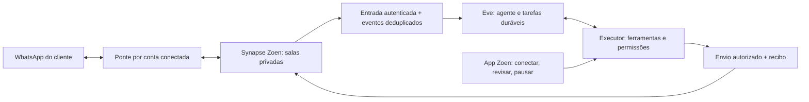

# Mensageria pessoal: Beeper, mautrix e referência Pally

Decisão proposta para Zoen, atualizada em 14/09/2026. Este documento detalha P06
do [desenho atual](../../eve/architecture.md). Nenhuma conta foi conectada ao Pally nem
ponte de usuário instalada para produzir esta análise.

## O comportamento que queremos oferecer

O cliente conecta seu próprio mensageiro dentro de Conexões. O Zoen passa a
acompanhar as conversas escolhidas, mostrar o que precisa de atenção, preparar
respostas e executar ações autorizadas com aquela conta. O cliente usa o painel
Zoen e sua conversa com o agente; instalar o aplicativo Beeper não é requisito
da modalidade hospedada.

Exemplo de jornada: “O que ficou pendente no grupo da viagem?” produz um resumo
com origem, período e perguntas abertas. “Responde que chego às oito” produz um
rascunho para o grupo correto, com a conta remetente visível. Após autorização,
o serviço envia a mensagem e devolve o estado real de entrega. O Zoen não precisa
ser adicionado como um novo participante daquele grupo: a ponte usa a conta
remota explicitamente conectada pelo cliente.

## O que foi confirmado sobre o Pally

O site descreve acompanhar chats WhatsApp, destacar mensagens importantes e
enviar respostas aprovadas. A receita de catch-up inclui resumos de mensagens
não lidas e organização por conversa. Isso confirma a referência de produto,
não o resultado de um teste independente. [Produto](https://pally.com/),
[WhatsApp catch-up](https://pally.com/recipes/whatsapp-catch-up).

A política de privacidade declara processamento de WhatsApp em servidor
dedicado por usuário, com remoção ao desconectar ou apagar os dados. A revisão
consultada está datada de 10/09/2026. Esta é uma declaração do fornecedor, não uma
inspeção de sua infraestrutura. [Política](https://pally.com/privacy).

O usuário relatou uma publicação no Twitter sobre uso de Beeper pelo Pally.
Não foi localizada confirmação direta desse detalhe nos materiais consultados.
Não atribuir ao Pally uma biblioteca, arquitetura ou versão específica sem a
fonte correspondente. Nossa escolha abaixo é independente dessa atribuição.

## A implementação recomendada

Beeper publica pontes open source e informa que são usadas tanto nas conexões
locais quanto no Beeper Cloud. Elas traduzem os eventos de redes remotas para
Matrix. A documentação distingue essas pontes das antigas integrações
JavaScript do Texts.com, marcadas como não mantidas; começar pelas pontes atuais.
[Open source Beeper](https://developers.beeper.com/open-source/),
[arquitetura de pontes](https://developers.beeper.com/bridges/).

Usar Synapse operado pelo Zoen e uma versão fixada de `mautrix-whatsapp` como
primeiro candidato. A documentação de instalação e autenticação da ponte é a
referência de implementação. Beeper Bridge Manager não serve como gerenciador
para nosso Synapse: seu próprio README restringe o destino ao homeserver Beeper.
[mautrix-whatsapp](https://docs.mau.fi/bridges/go/whatsapp/),
[Bridge Manager](https://github.com/beeper/bridge-manager).

O diagrama é o contrato desejado. Os adaptadores atuais de Matrix e canais não
implementam automaticamente esse caminho completo.

## Conectar uma conta no app

1. Em Conexões, escolher “Meu WhatsApp”. Essa opção difere de conversar com o bot
   Zoen ou verificar o telefone para login.
2. Criar um desafio de pareamento com prazo, associado à identidade Zoen e ao
   espaço escolhido. Apresentar QR/código conforme a versão da ponte suporta.
3. Confirmar no aparelho. A interface aguarda prova do login remoto e mostra a
   conta efetivamente conectada, não apenas “QR exibido”.
4. Escolher quais conversas o Zoen pode acompanhar e o intervalo inicial de
   histórico. Mostrar o que foi sincronizado e o que não está disponível.
5. Exibir estado, último sincronismo, pausa e desconexão na mesma lista de
   Conexões. Tratar sessão expirada e novo pareamento sem criar outro usuário.

Reusar o componente visual de sheet e a navegação existentes, com PT-BR/EN/ES.
Reusar o serviço de identidade para a prova de dono, mas não confundir uma
confirmação de login Zoen com autorização de acesso aos chats do mensageiro.

## Infraestrutura e isolamento

Declarar os recursos na infraestrutura Alchemy existente: imagem e configuração
da ponte, serviço privado, volumes, credenciais de aplicação, health check,
backup e recuperação. No piloto, usar execução e armazenamento isolados por
conta conectada. Medir memória, conexões persistentes, espaço e custo por conta
antes de definir a densidade de hospedagem para mais usuários.

Reusar o Synapse existente com salas, participantes e namespaces controlados.
Compartilhar um homeserver não compartilha salas entre clientes. Tokens amplos
de application service e sessões de redes remotas ficam apenas nos processos
que precisam deles. Um parâmetro de API ou do modelo nunca escolhe livremente
uma identidade que esse token pode representar.

Testar a implementação criptográfica e recuperação de chaves escolhida. A ponte
participa da fronteira de confiança e processa mensagens para convertê-las;
não descrever isso como conteúdo invisível a toda a infraestrutura Zoen.

O banco operacional guarda estado da conexão, vínculo com usuário/espaço,
referências dos eventos, sincronização, concessões e outbox. Mensagens e mídia
têm armazenamento com escopo e retenção próprios. Git versiona definições de
tools, skills e instruções; não vira um arquivo indiscriminado dos chats.

## O que o Executor expõe

Reutilizar os padrões existentes de descoberta e schemas. Criar apenas as
operações necessárias, com nomes e tipos ancorados no catálogo único:

- Listar conversas e consultar o estado da conexão.
- Ler ou buscar mensagens dentro de conversas autorizadas e de um período.
- Recuperar mídia permitida, preservando origem e escopo.
- Criar e revisar um rascunho associado ao remetente e destinatário exatos.
- Enviar sob autorização válida e consultar o recibo.
- Configurar, pausar e revogar um acompanhamento autorizado.

Os nomes acima são capacidades propostas, não métodos já cadastrados. Avaliar
`channel/chat-sdk-beeper` no registry Eve antes de reutilizá-lo: um adaptador
de canal não necessariamente cobre pareamento de usuário, busca de histórico,
segregação por conta ou envio delegado. Não criar outro loop de agente para
compensar diferenças do adaptador.

## Sincronização, resumo e resposta

Guardar cursor por conexão/conversa. Separar histórico inicial de novos eventos
para não tratar um backfill como mensagens que acabaram de chegar. Eventos
repetidos devem convergir para uma única mensagem lógica e nunca disparar a
mesma resposta duas vezes. Edições, exclusões e read receipts precisam de
tratamento explícito conforme o suporte da rede.

Nem toda mensagem sincronizada dispara o modelo. Acompanhamentos autorizados
agrupam eventos por período e só geram um aviso quando as condições configuradas
acontecem. Usar o scheduler e as tarefas duráveis existentes do Eve. Pausar
interrompe novos trabalhos; revogar interrompe também usos pendentes da conexão.

Um resumo informa período coberto e aponta para mensagens de origem. Se parte
do histórico não chegou, informar cobertura parcial. Follow-ups consultam as
respostas mais recentes antes de enviar e param quando a pendência se resolve.

No primeiro lançamento, envio para terceiros exige autorização do conteúdo,
conta e destinatário; uma instrução explícita e suficientemente determinada do
usuário pode fornecer essa autorização. Quando houver ambiguidade ou mudança
do rascunho, pedir revisão do resultado concreto. Automação posterior precisa
de regra pré-autorizada com chats, finalidade, duração e limites definidos.

Após um timeout de envio, reconciliar o estado pelo identificador da operação
ou pelos eventos do provedor antes de tentar novamente. Não marcar “entregue”
com base apenas em enqueue ou HTTP aceito. Preservar a diferença entre aceito,
enviado, entregue e lido quando a rede realmente fornecer cada confirmação.

## Pessoas, empresas e redes de confiança

Uma conversa importada não coloca seus participantes automaticamente na rede
de confiança do Zoen. Sincronização de contatos, permissão para ler um chat e
permissão A2A são três relações diferentes.

O WhatsApp pessoal permanece pessoal mesmo quando seu dono também é funcionário
de uma empresa. Para acompanhar um grupo de trabalho no espaço corporativo,
criar vínculo explícito entre aquele grupo, a conta autorizada e o espaço. A
empresa não recebe o restante dos chats do funcionário. Resumos não atravessam
essas fronteiras por causa da seleção visual de um switch.

Matrix transporta tanto salas A2A quanto conversas bridged, mas a audiência de
cada uma permanece independente. Outro bot da rede de confiança não pode pedir
ao nosso agente para ler qualquer conversa conectada só por ser um colega.

## Desktop como alternativa opcional

Para quem já usa Beeper, sua API Desktop pode oferecer uma conexão local. Ela
requer o app rodando e oferece OAuth com PKCE. Isso exige um caminho autorizado
entre o serviço e aquele dispositivo; o servidor Zoen não consegue chamar o
`localhost` do cliente diretamente. Não expor a API local inteira à internet.
[Desktop API](https://developers.beeper.com/desktop-api/),
[autorização](https://developers.beeper.com/desktop-api/auth/).

Essa opção não bloqueia o trabalho da ponte hospedada. Não prometer paridade
entre as duas modalidades sem testar o conjunto de capacidades de cada uma.

## Entrega incremental e prova

Primeiro implementar conectar → ler DM e grupo → resumo com origem → resposta
autorizada → recibo → desconectar. Depois adicionar mídia, pesquisa, catch-up e
follow-ups; ampliar para Telegram de usuário e outras redes separadamente.
Preservar os canais de bot já disponíveis durante esse trabalho.

Executar os casos BR da [matriz](acceptance.csv), incluindo pareamento real,
grupo existente de teste, histórico parcial, read receipts, edição de rascunho,
pausa, reconexão, duplicação, isolamento, cancelamento e exclusão. Conferir o
autor no aplicativo remoto. A entrega não está pronta por compilar uma ponte
ou receber um webhook; precisa concluir esse ciclo com uma conta autorizada.
